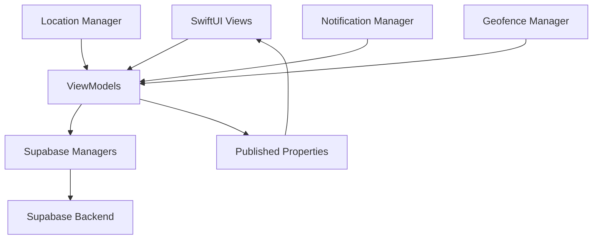

# 🚚 Fleet Master - Professional Fleet Management iOS App

<div align="center">


[](https://swift.org)
[](https://developer.apple.com/ios/)
[](https://developer.apple.com/xcode/swiftui/)
[](https://supabase.io)

**A comprehensive, real-time fleet management solution for iOS that transforms how organizations manage their vehicle operations, drivers, and maintenance schedules.**

[Features](#-features) • [Installation](#-installation) • [Architecture](#-architecture) • [Usage](#-usage) • [API](#-api-reference) • [Contributing](#-contributing)

</div>

---

## 📱 Overview

Fleet Master is a state-of-the-art iOS application designed for comprehensive fleet management operations. Built with SwiftUI and powered by Supabase backend, it provides real-time tracking, intelligent trip management, proactive maintenance scheduling, and detailed analytics for fleet operations of any scale.

### 🎯 Key Benefits

- **Real-time Visibility**: Live tracking of all vehicles and drivers
- **Operational Efficiency**: Streamlined trip planning and execution
- **Proactive Maintenance**: Automated scheduling and alerts
- **Data-Driven Insights**: Comprehensive analytics and reporting
- **Mobile-First Design**: Native iOS experience with offline capabilities

---

## ✨ Features

### 🚗 **Trip Management**
- **Smart Scheduling**: Advanced trip planning with conflict detection
- **Real-time Tracking**: Live GPS monitoring with route optimization
- **Status Management**: Dynamic trip status updates (Scheduled → In Progress → Completed)
- **Route Analytics**: ETA calculations, distance tracking, and route history
- **Geofencing**: Automated alerts for departure/arrival events
- **Route Deviation Monitoring**: Real-time alerts for off-route events

### 👨‍💼 **Driver Management**
- **Comprehensive Profiles**: Complete driver information with photo support
- **License Management**: Indian driving license categories and validation
- **Availability Tracking**: Real-time driver availability status
- **Performance Analytics**: Trip completion rates and efficiency metrics
- **Assignment Optimization**: Smart driver-vehicle-trip matching
- **Document Management**: License expiry tracking and renewals

### 🚛 **Vehicle Management**
- **Complete Vehicle Profiles**: Registration, insurance, and certification tracking
- **Multi-category Support**: LMV, HMV, HPMV vehicle classifications
- **Document Tracking**: RC, insurance, and pollution certificate monitoring
- **Status Management**: Available, In Use, Under Maintenance status tracking
- **Maintenance Scheduling**: Automated service reminders
- **Fuel Type Management**: Petrol, Diesel, CNG, Electric support

### 🔧 **Maintenance Management**
- **Intelligent Scheduling**: Predictive maintenance based on usage patterns
- **Request Management**: Driver-initiated maintenance requests
- **Personnel Management**: Maintenance staff assignment and tracking
- **Service History**: Comprehensive maintenance records
- **Cost Tracking**: Service cost monitoring and budgeting
- **Compliance Alerts**: Regulatory compliance monitoring

### 📊 **Analytics & Reporting**
- **Interactive Dashboards**: Real-time KPI visualization with Swift Charts
- **Fleet Summary**: Vehicle utilization, driver efficiency, maintenance costs
- **Trip Analytics**: Completion rates, delay analysis, route efficiency
- **Maintenance Insights**: Cost trends, service intervals, breakdown analysis
- **Custom Reports**: Exportable reports for management review

### 🔔 **Smart Notifications**
- **Trip Alerts**: Start, completion, and delay notifications
- **Maintenance Reminders**: Service due dates and overdue alerts
- **Geofence Events**: Entry/exit notifications for designated areas
- **Document Expiry**: Insurance, license, and certificate renewal alerts
- **Emergency Notifications**: Breakdown and urgent maintenance requests

### 🗺️ **Advanced Mapping**
- **Real-time Vehicle Tracking**: Live location updates with heading indicators
- **Route Visualization**: Interactive maps with trip routes
- **Geofence Management**: Custom area monitoring and alerts
- **Offline Maps**: Cached map data for poor connectivity areas
- **Multi-vehicle View**: Simultaneous tracking of entire fleet

---

## 🛠 Installation

### Prerequisites

- **Xcode 15.0+**
- **iOS 15.0+**
- **Swift 5.9+**
- **macOS 12.0+** (for development)

### Dependencies

The project uses the following key dependencies:

```swift
// Core Dependencies
import SwiftUI          // Native UI framework
import Supabase         // Backend and authentication
import CoreLocation     // GPS and location services
import MapKit           // Mapping and geolocation
import Charts           // Data visualization
import UserNotifications // Push notifications
import Security         // Keychain management
```

### Setup Instructions

1. **Clone the Repository**
   ```bash
   git clone https://github.com/your-username/fleet-master.git
   cd fleet-master
   ```

2. **Open in Xcode**
   ```bash
   open "Fleet Master.xcodeproj"
   ```

3. **Configure Supabase**
   
   Update `Supabase.swift` with your Supabase credentials:
   ```swift
   supabase = SupabaseClient(
       supabaseURL: URL(string: "YOUR_SUPABASE_URL")!,
       supabaseKey: "YOUR_SUPABASE_ANON_KEY"
   )
   ```

4. **Database Setup**
   
   Execute the following SQL in your Supabase dashboard:
   ```sql
   -- Create main tables
   CREATE TABLE drivers (
       id UUID PRIMARY KEY DEFAULT gen_random_uuid(),
       name TEXT NOT NULL,
       email TEXT UNIQUE NOT NULL,
       phone TEXT NOT NULL,
       license_number TEXT UNIQUE NOT NULL,
       hire_date TIMESTAMP NOT NULL,
       is_active BOOLEAN DEFAULT true,
       is_available BOOLEAN DEFAULT true,
       vehicle_categories TEXT[] DEFAULT '{}'
   );

   CREATE TABLE vehicles (
       id UUID PRIMARY KEY DEFAULT gen_random_uuid(),
       registration_number TEXT UNIQUE NOT NULL,
       make TEXT NOT NULL,
       model TEXT NOT NULL,
       year INTEGER NOT NULL,
       fuel_type TEXT NOT NULL,
       vehicle_type TEXT NOT NULL,
       is_active BOOLEAN DEFAULT true,
       vehicle_status TEXT DEFAULT 'available'
   );

   CREATE TABLE trips (
       id UUID PRIMARY KEY DEFAULT gen_random_uuid(),
       title TEXT NOT NULL,
       start_location TEXT NOT NULL,
       end_location TEXT NOT NULL,
       scheduled_start_time TIMESTAMP NOT NULL,
       scheduled_end_time TIMESTAMP NOT NULL,
       status TEXT DEFAULT 'scheduled',
       driver_id UUID REFERENCES drivers(id),
       vehicle_id UUID REFERENCES vehicles(id)
   );
   ```

5. **Configure Permissions**
   
   Add the following to `Info.plist`:
   ```xml
   <key>NSLocationAlwaysAndWhenInUseUsageDescription</key>
   <string>Fleet Master needs location access to track vehicles and provide navigation services.</string>
   
   <key>NSLocationWhenInUseUsageDescription</key>
   <string>This app uses location services to track fleet vehicles and optimize routes.</string>
   
   <key>NSUserNotificationCenterDelegate</key>
   <string>Fleet Master sends notifications for trip updates and maintenance alerts.</string>
   ```

6. **Build and Run**
   - Select your target device or simulator
   - Press `Cmd + R` or click the Run button
   - The app will launch with the login screen

---

## 🏗 Architecture

Fleet Master follows a modern MVVM (Model-View-ViewModel) architecture with SwiftUI, ensuring clean separation of concerns and optimal performance.

### 📁 Project Structure

```
Fleet Master/
├── 📱 App/
│   ├── Fleet_MasterApp.swift      # App entry point
│   ├── ContentView.swift          # Root view
│   └── Supabase.swift            # Backend configuration
│
├── 🏗 Models/
│   ├── Driver.swift              # Driver data model
│   ├── Vehicle.swift             # Vehicle data model
│   ├── Trip.swift                # Trip data model
│   ├── LocationManager.swift     # GPS and location services
│   ├── NotificationManager.swift # Push notifications
│   ├── GeofenceManager.swift     # Geofencing services
│   └── *SupabaseManager.swift    # Backend data managers
│
├── 🎯 ViewModels/
│   ├── AppStateManager.swift     # Global app state
│   ├── DriverViewModel.swift     # Driver business logic
│   ├── VehicleViewModel.swift    # Vehicle business logic
│   ├── TripViewModel.swift       # Trip business logic
│   └── MaintenanceViewModel.swift # Maintenance logic
│
├── 🎨 Views/
│   ├── DashboardView.swift       # Main dashboard
│   ├── TripManagementView.swift  # Trip operations
│   ├── DriverManagementView.swift # Driver operations
│   ├── VehicleManagementView.swift # Vehicle operations
│   ├── MaintenanceManagementView.swift # Maintenance
│   └── Components/
│       ├── LiveMapView.swift     # Real-time mapping
│       ├── TripProgressView.swift # Trip status
│       └── ActiveTripCard.swift   # Trip cards
│
└── 🔧 Extensions/
    └── CLLocationCoordinate2D+Extension.swift
```

### 🔄 Data Flow



### 🧩 Key Components

#### **ViewModels**
- `AppStateManager`: Global authentication and app state
- `TripViewModel`: Trip CRUD operations and real-time updates
- `DriverViewModel`: Driver management and availability tracking
- `VehicleViewModel`: Vehicle status and assignment management
- `MaintenanceViewModel`: Maintenance scheduling and tracking

#### **Managers**
- `LocationManager`: GPS tracking, route monitoring, geofencing
- `NotificationManager`: Push notifications and alert management
- `GeofenceManager`: Area-based monitoring and event triggers
- `SupabaseManager`: Backend communication and data synchronization

---

## 📱 Usage

### 🔐 Authentication

Fleet Master uses secure authentication powered by Supabase:

```swift
// Login process
let viewModel = LoginViewModel()
await viewModel.signIn(email: "user@company.com", password: "password")

// Session management with automatic refresh
let appState = AppStateManager()
appState.isLoggedIn // Reactive authentication state
```

### 🚗 Trip Management

#### Creating a New Trip

1. Navigate to **Trip Management** → **Add Trip**
2. Fill in trip details:
   - **Title**: Descriptive trip name
   - **Start/End Locations**: GPS coordinates or addresses
   - **Schedule**: Date and time selection
   - **Driver/Vehicle Assignment**: Available resource selection

```swift
let trip = Trip(
    title: "Delivery to Mumbai",
    startLocation: "Delhi Warehouse",
    endLocation: "Mumbai Distribution Center",
    scheduledStartTime: Date(),
    scheduledEndTime: Date().addingTimeInterval(3600 * 8)
)

await tripViewModel.addTrip(trip)
```

#### Real-time Trip Tracking

- **Live Updates**: Automatic status synchronization
- **Route Monitoring**: GPS tracking with route adherence
- **ETA Calculations**: Dynamic arrival time estimates
- **Geofence Alerts**: Automated departure/arrival notifications

### 👨‍💼 Driver Management

#### Adding New Drivers

```swift
let driver = Driver(
    name: "John Doe",
    email: "john@company.com",
    phone: "+91-9876543210",
    licenseNumber: "DL-123456789",
    vehicleCategories: ["LMV-TR", "MGV"]
)

await driverViewModel.addDriver(driver)
```

#### License Categories Supported

- **LMV-TR**: Light Motor Vehicle - Transport
- **MGV**: Medium Goods Vehicle  
- **HMV**: Heavy Motor Vehicle
- **HPMV**: Heavy Passenger Motor Vehicle
- **PSV**: Public Service Vehicle Badge

### 🚛 Vehicle Management

#### Vehicle Registration

```swift
let vehicle = Vehicle(
    registrationNumber: "DL-01-AB-1234",
    make: "Tata",
    model: "Ace",
    year: 2023,
    fuelType: .diesel,
    vehicleType: .lightCommercial
)

await vehicleViewModel.addVehicle(vehicle)
```

#### Document Tracking

- **RC Expiry**: Registration certificate monitoring
- **Insurance**: Policy tracking and renewal alerts  
- **Pollution Certificate**: Environmental compliance
- **Service Records**: Maintenance history and scheduling

### 🔧 Maintenance Operations

#### Scheduling Maintenance

```swift
let maintenanceRequest = MaintenanceRequest(
    vehicleId: vehicle.id,
    serviceType: .routineService,
    scheduledDate: Date(),
    estimatedCost: 5000,
    notes: "Regular 10,000 km service"
)

await maintenanceViewModel.scheduleService(maintenanceRequest)
```

#### Maintenance Types

- **Routine Service**: Regular scheduled maintenance
- **Repair**: Breakdown and damage repairs
- **Inspection**: Safety and compliance checks
- **Upgrade**: Vehicle modifications and improvements

---

## 📊 API Reference

### Core Data Models

#### Driver Model
```swift
struct Driver: Identifiable, Codable {
    var id: String
    var name: String
    var email: String
    var phone: String
    var licenseNumber: String
    var hireDate: Date
    var isActive: Bool
    var isAvailable: Bool
    var vehicleCategories: [String]
}
```

#### Vehicle Model
```swift
struct Vehicle: Identifiable, Codable {
    var id: String
    var registrationNumber: String
    var make: String
    var model: String
    var year: Int
    var fuelType: FuelType
    var vehicleType: VehicleType
    var isActive: Bool
    var vehicle_status: VehicleStatus
}
```

#### Trip Model
```swift
struct Trip: Identifiable, Codable {
    var id: String
    var title: String
    var startLocation: String
    var endLocation: String
    var scheduledStartTime: Date
    var scheduledEndTime: Date
    var status: TripStatus
    var driverId: String?
    var vehicleId: String?
}
```

### Key Enumerations

```swift
enum TripStatus: String, CaseIterable {
    case scheduled = "scheduled"
    case inProgress = "in_progress"
    case completed = "completed"
    case cancelled = "cancelled"
}

enum VehicleStatus: String, CaseIterable {
    case available = "available"
    case inUse = "in_use"
    case maintenance = "maintenance"
    case outOfService = "out_of_service"
}

enum FuelType: String, CaseIterable {
    case petrol = "petrol"
    case diesel = "diesel"
    case cng = "cng"
    case electric = "electric"
}
```

---

## 🔧 Configuration

### Environment Variables

Create a `Config.swift` file for environment-specific settings:

```swift
struct Config {
    static let supabaseURL = "https://your-project.supabase.co"
    static let supabaseAnonKey = "your-anon-key"
    static let googleMapsAPIKey = "your-maps-api-key"
    
    // Notification settings
    static let enablePushNotifications = true
    static let geofenceRadius: Double = 100 // meters
    static let routeDeviationThreshold: Double = 500 // meters
}
```

### Customization Options

#### Notification Preferences
```swift
// Configure in NotificationManager
offRouteThresholdMeters = 500
delayThresholdMinutes = 10
geofenceAlertEnabled = true
```

#### Location Settings
```swift
// Configure in LocationManager
desiredAccuracy = kCLLocationAccuracyBest
distanceFilter = 10 // meters
```

---

## 🚀 Performance Optimization

### Memory Management
- Efficient use of `@StateObject` and `@ObservedObject`
- Lazy loading of trip and vehicle data
- Image caching for driver profiles

### Network Optimization
- Background data synchronization
- Offline data persistence
- Optimistic UI updates

### Battery Life
- Smart location tracking intervals
- Background app refresh optimization
- Efficient geofence monitoring

---

## 🔒 Security Features

### Data Protection
- **Keychain Storage**: Secure credential management
- **Biometric Authentication**: Touch ID/Face ID support
- **Session Management**: Automatic token refresh
- **Data Encryption**: In-transit and at-rest encryption

### Privacy Compliance
- **Location Privacy**: User consent for tracking
- **Data Minimization**: Only necessary data collection
- **GDPR Compliance**: Data export and deletion capabilities

---

## 🧪 Testing

### Unit Tests
```bash
# Run unit tests
xcodebuild test -scheme "Fleet Master" -destination "platform=iOS Simulator,name=iPhone 15 Pro"
```

### Integration Tests
- Supabase connectivity testing
- Location services simulation
- Notification delivery verification

### UI Tests
- Critical user flow automation
- Accessibility testing
- Performance benchmarking

---

## 📈 Future Roadmap

### Planned Features
- [ ] **AI-Powered Route Optimization**
- [ ] **Predictive Maintenance Analytics**
- [ ] **Driver Performance Scoring**
- [ ] **Fuel Consumption Tracking**
- [ ] **Carbon Footprint Monitoring**
- [ ] **Multi-language Support**
- [ ] **Apple Watch Companion App**
- [ ] **Siri Integration**
- [ ] **CarPlay Support**

### Technical Improvements
- [ ] **SwiftData Migration** (iOS 17+)
- [ ] **Widgets Implementation**
- [ ] **Advanced Analytics Dashboard**
- [ ] **Real-time Collaboration Features**
- [ ] **API Rate Limiting**
- [ ] **Advanced Caching Strategies**

---

## 🤝 Contributing

We welcome contributions from the community! Please read our [Contributing Guidelines](CONTRIBUTING.md) before submitting pull requests.

### Development Setup

1. Fork the repository
2. Create your feature branch (`git checkout -b feature/AmazingFeature`)
3. Commit your changes (`git commit -m 'Add some AmazingFeature'`)
4. Push to the branch (`git push origin feature/AmazingFeature`)
5. Open a Pull Request

### Code Style

We follow Swift's official style guide and use SwiftLint for code consistency:

```bash
# Install SwiftLint
brew install swiftlint

# Run linting
swiftlint
```

---

## 📄 License

This project is licensed under the MIT License - see the [LICENSE](LICENSE) file for details.

---

## 👨‍💻 Authors

- **Kushagra Kulshrestha** - *Initial Development* - [@kushagra](https://github.com/kushagra)
- **Deepak Prajapati** - *Project Lead* - [@deepakprajapati](https://github.com/deepakprajapati)

---

## 🙏 Acknowledgments

- **Supabase Team** for the excellent backend-as-a-service platform
- **Apple Developer Community** for SwiftUI best practices
- **OpenStreetMap Contributors** for mapping data
- **SF Symbols** for the beautiful iconography

---

## 📞 Support

For support and questions:

- 📧 **Email**: support@fleetmaster.app
- 🐛 **Bug Reports**: [GitHub Issues](https://github.com/your-username/fleet-master/issues)
- 💬 **Discussions**: [GitHub Discussions](https://github.com/your-username/fleet-master/discussions)
- 📖 **Documentation**: [Wiki](https://github.com/your-username/fleet-master/wiki)

---

<div align="center">

**Made with ❤️ for the fleet management community**

[](https://github.com/your-username/fleet-master/stargazers)
[](https://github.com/your-username/fleet-master/network/members)
[](https://github.com/your-username/fleet-master/issues)

</div>
